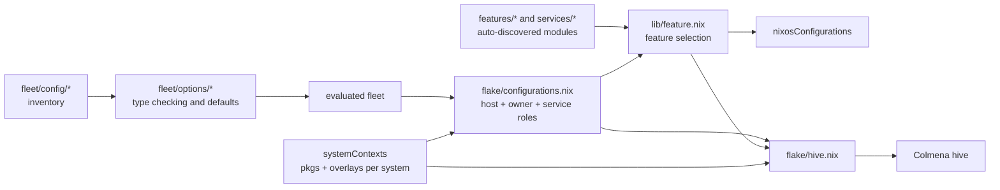

# Fleet architecture

This repository is a declarative NixOS fleet. A small, typed inventory describes hosts, users, groups, and services; reusable feature modules turn that inventory into host configurations; the same evaluated configurations feed both flake outputs and Colmena deployments.

## Configuration flow

`flake.nix` creates one package context for each system in `flake/systems.nix`. Each context imports Nixpkgs with the repository overlays and unfree packages enabled, and supplies both `pkgs` and the formatter. Reusing these contexts prevents each host and Colmena from independently applying overlays or evaluating Nixpkgs.

`flake/configurations.nix` is the main composition boundary:

1. It evaluates `fleet/config` against the option schema in `fleet/options`.
2. It currently keeps only hosts whose derived `platform` is `nixos`.
3. For each host, it derives that host's primary/backup services, resolves its owner, selects feature modules, and injects `fleet`, `host`, `user`, and `helpers` as module arguments.
4. It produces a shared `hostConfigurations` representation, then turns it into `nixosConfigurations`.

`flake/hive.nix` consumes the same `hostConfigurations`. It adds Colmena deployment metadata without rebuilding the configuration graph or reapplying overlays.

## Fleet data model

The inventory lives in `fleet/config/`; its schema and defaults live in `fleet/options/`.

| Entity | Important fields | Role |
| --- | --- | --- |
| Fleet | `domain`, `timeZone`, fonts, themes, wallpaper | Values shared by modules on every host |
| Host | `system`, `owner`, `targetHost`, tags, interfaces, monitors, preservation | Build/deploy target and feature-selection input |
| User | identity, logical groups, UID, admin flag | Primary account materialized on an owned host |
| Group | `isPosix`, logical member groups | Maps logical membership to host POSIX groups |
| Service | `primary`, `backups`, `port`, `proxyPort`, `feature` | Places a service and selects its implementation feature |

Names are generally derived from attribute keys and exposed as read-only `name` fields. A host's `platform` is derived from its `system`. The schema recognizes NixOS and Darwin platforms, but `flake/systems.nix` currently contains Linux systems only and configuration generation currently filters to NixOS.

## Feature composition

`lib/feature.nix` auto-discovers every directory directly beneath both `features/` and `services/`. Names must be unique across the two roots. A feature's `default.nix` returns an attribute set with:

- optional `imports`, which recursively compose smaller feature fragments;
- `modules.generic`, for modules applicable across platforms;
- `modules.nixos` and/or `modules.darwin`, for platform modules.

Each module value may be one module or a list. Imported fragments are merged before the parent fragment, while preserving declaration order.

For a host, features are selected in this order and then de-duplicated while keeping the first occurrence:

1. `base` always;
2. `boot` for NixOS;
3. `programs-core` and `theming` for hosts tagged `desktop`;
4. `desktop-shell` for NixOS desktop hosts;
5. `nvidia` for `gpu:nvidia`;
6. `feature:<name>` tags, mapped to `programs-<name>`;
7. `preservation` when `host.preservation.enable` is true;
8. explicit `host.features`;
9. the `feature` named by each service assigned to the host.

Selection fails during evaluation if a feature is unknown or does not provide modules for the host platform. This makes tags and service placement part of the checked configuration rather than informal metadata.

The base feature also declares the repository's shared module options. In particular, `persist` and `persistUser` can be extended by any feature even when preservation is disabled on a host. When preservation is enabled, `features/preservation/default.nix` maps those accumulated declarations into the preservation module.

## Service topology

`lib/service.nix` is the topology layer:

- `servicesForHost` attaches `primary` or `backup` roles and filters out unrelated services.
- `requireRoutedService` lets an implementation assert that it was selected for the current host.
- `hostIps` and `primaryIpV4` normalize interface addresses from the inventory.
- `reverseProxy` routes every non-Caddy service through the primary Caddy host. Route names are `<service>.<primary-host>.<fleet-domain>`, and `proxyPort` is preferred over `port`.

Service implementations live in `services/<feature>/default.nix` and participate in exactly the same feature loader as regular features. The service inventory determines placement; the implementation determines NixOS configuration, firewall behavior, persistence, and secrets.

## Packages, resources, and secrets

`flake/packages.nix` auto-discovers `packages/*/package.nix` and exposes each package under `pkgs.local`. The flake also exports those local packages, plus selected architecture-specific packages. `flake/overlays.nix` adds upstream inputs, local packages, and repository-specific package overrides.

`resources/` contains source-controlled themes, templates, icons, and wallpapers consumed by feature modules. Generated user configuration is generally installed through `hjem` or built into immutable theme profiles.

Secrets use agenix. Host SSH keys are the default age identities, encrypted files live under `secrets/`, and recipient declarations live in `secrets/secrets.nix`. Some service modules deliberately guard optional encrypted files with `builtins.pathExists`, allowing evaluation before a local secret is present.

## Outputs and validation

The flake exposes:

- `nixosConfigurations.<host>` for each NixOS host;
- `colmenaHive` for deployment;
- per-system packages, formatter, development shell, and checks;
- a `treefmt` check and a `nix-unit` test derivation.

Unit tests focus on the two pure composition libraries: feature selection/loading behavior and service topology. The full `nix flake check` additionally evaluates the flake and enforces formatting/static checks.
